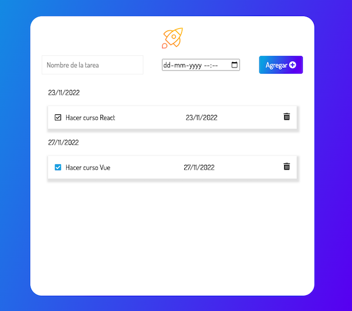

# Lista de Tareas en JavaScript

## Pequeña lista de tareas creada con __HTML__,__CSS__ y __JavaScript__
### Realizada en el curso de __Front end__ de __Alura Latam__ y __Oracle__ __ONE__.

Con ella aprendimos como utilizar el _localStorage_ y manejo del ***DOM*** con JavaScript